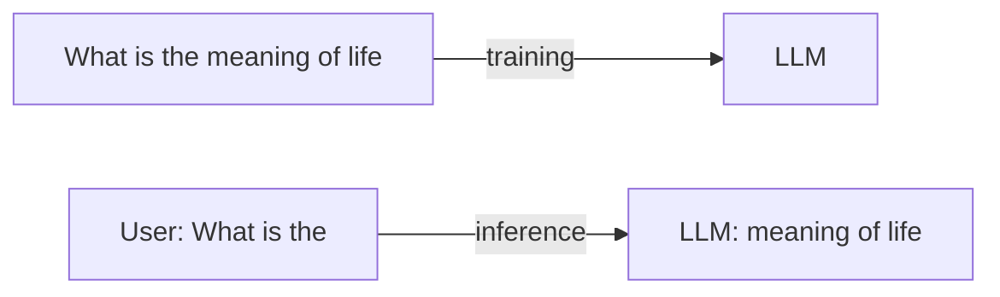
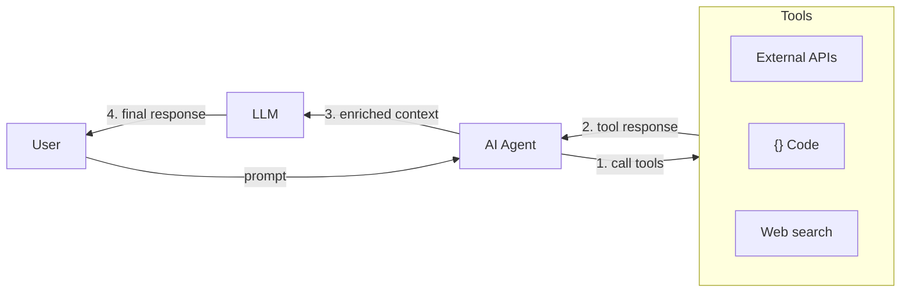
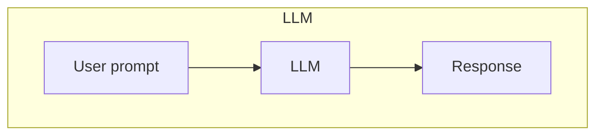
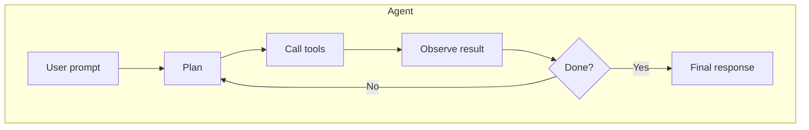
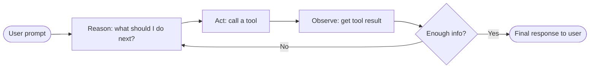
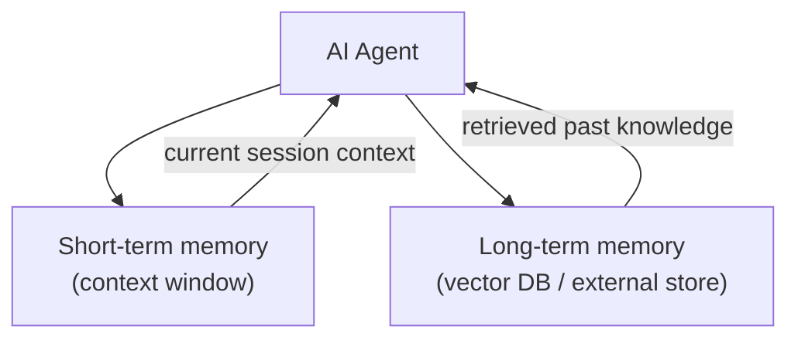
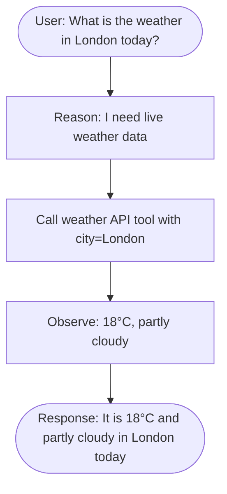

# Create your first AI agent for free

## Table of content
1. [Intro](#intro)
2. [What are large language models (LLM)?](#large-language-models-llms)
3. [What are AI Agents and how they fit LLMs?](#ai-agents)
4. [Building an AI agent](#building-an-ai-agent)


## Large language models (LLMs)
LLMs are computer systems trained on huge amount of training data giving them the ability to mimic
human intelligence. You can think of them like super-powered autocompletes, because at the end
that is what LLM actually does - you give it a sentence or even a single word and based on certain
probabilities, the model predicts what the next word should be. Thats pretty much what they do.
The interesting question would be - how do they do it?

Let say that you start with the sentence `What is the...`. Based on the data that the model had been
trained with, it will pick a word based on certain set of probabilities, for example.

| Next word  | Approx. probability |
| ---------- | ------------------- |
| meaning    | 7–10%               |
| best       | 5–8%                |
| difference | 4–7%                |
| purpose    | 3–6%                |
| capital    | 3–6%                |
| reason     | 2–5%                |
| point      | 2–4%                |
| name       | 2–4%                |
| definition | 2–4%                |
| value      | 1–3%                |


In other words, the model don't know what you are currently trying to say, so it will pick up a word (a process called inference)
that best matches the `context` that it is given. Unfortunatelly, models do not work with your sentences
and words directly and it has to convert them to so called `tokens` first.

The following app called [tiktokenizer](https://tiktokenizer.vercel.app/?model=codellama%2FCodeLlama-70b-hf)
can give you an idea how each model translates words into tokens. In this particular case for `Llama 70b model`
the sentence `What is the` is mapped to `1724, 338, 278` numbers or tokens.

These tokens are then fed into a neural network which based on its settings or weights will give you one of the words depicted above (or many others depending on training data sets). LLMs don’t really know when to stop—they just keep predicting the next word until they eventually predict a special ‘end’ token or hit a predefined limit.



Note: LLMs became widespread after the introduction of `transformer` [architecture](https://proceedings.neurips.cc/paper_files/paper/2017/file/3f5ee243547dee91fbd053c1c4a845aa-Paper.pdf) back in 2016.

## AI Agents
Now that we have an idea of what LLMs are, let’s take it one step further and talk about agents.

An agent is essentially a system that uses a language model, but adds a bit more structure and logic around it. Instead of just responding to a single prompt, an agent can take actions, make decisions, and even use tools.

Think of it like this:
A language model is the brain, and the agent is the whole system — the brain plus memory, tools, and decision-making.



So instead of just answering a question, an agent could, for example, look up information, call an API, or perform some task before responding.

### LLM vs Agent

To make this concrete, here is the difference between a plain LLM call and an agent handling the same question:





### The agent reasoning loop (ReAct)

Agents don't just call a tool once and stop. They follow a continuous loop known as the **ReAct** pattern — short for **Reason, Act, Observe**:

1. **Reason** — the LLM looks at the current context and decides what to do next
2. **Act** — it calls a tool or takes an action
3. **Observe** — the result is fed back into the context
4. The loop repeats until the agent decides it has enough information to give a final answer



### Memory

Agents can also maintain memory across interactions, which comes in two forms:

- **Short-term memory** — the current conversation stored in the context window, available during a single session
- **Long-term memory** — an external store (e.g. a vector database) the agent can query to recall information from past sessions



### Concrete example

Let's say a user asks: *"What is the weather in London today?"*

A plain LLM would either make something up or say it doesn't have live data. An agent handles it like this:



## Building an AI agent

The time has arrived to build our first AI agent. We will be using Google's ADK and Python to complete this task. Make sure you have the following installed:

* Python >= 3.10
* pip - to install Python packages
* Google AI Studio API key

1. Install google's ADK in a virtual environment

```
python -m venv venv

# Activate (each new terminal)
# macOS/Linux: source .venv/bin/activate
# Windows CMD: .venv\Scripts\activate.bat
# Windows PowerShell: .venv\Scripts\Activate.ps1

pip install google-adk
```

2. Create the project

```
adk create my_first_agent
```

3. Explore the project you've just created

When exploring the project, you will see a single file called agent.py which hold the source code
for your AI agent. Looking at the code its not much but it is a starting point.

```
my_first_agent
├── __init__.py
└── agent.py

# agent.py
root_agent = Agent(
    model='gemini-2.5-flash',
    name='root_agent',
    description='A helpful assistant for user questions.',
    instruction='Answer user questions to the best of your knowledge',
)
```

4. Start the agent

```
adk web
```

Once you start the agent you should navigate to `http://127.0.0.1:8000` and see the following welcome screen.

